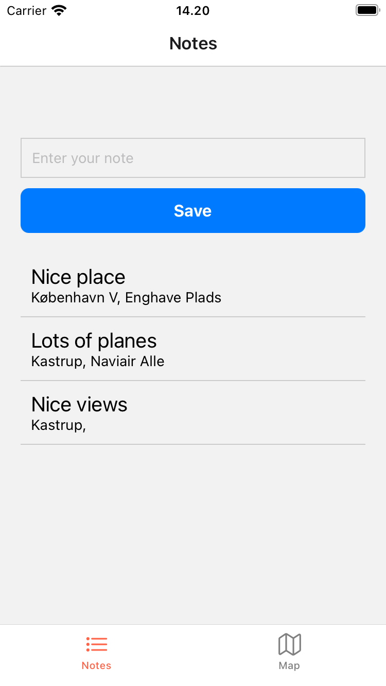

# Note/Map app - React Native

## Overview

This application allows users to take notes with optional location data and images. The app integrates Firebase Firestore/Storage to store notes, including text, location coordinates, and images. The user can view notes on a map and edit them as needed. Additionally, the app supports adding new notes by tapping on the map and saving them with location information.

### You'll have to provide your own firebaseConfig.js

---

### Screenshot 1

**List of notes, along with their location:**

---

### 
**Details for a single note which has both image and location:**

---

### 
**Editing a notes text:**

---

### 
**Prompt for uploading/chaning image for a note:**

---

### 
**Map with markers for note locations:**

---

### 
**Viewing a note on the map:**

---

### 
**Adding a new note on the map by long-pressing**