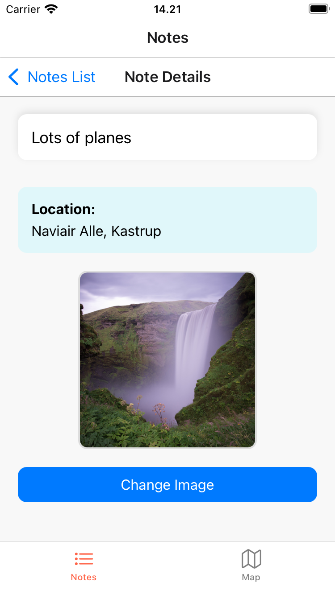
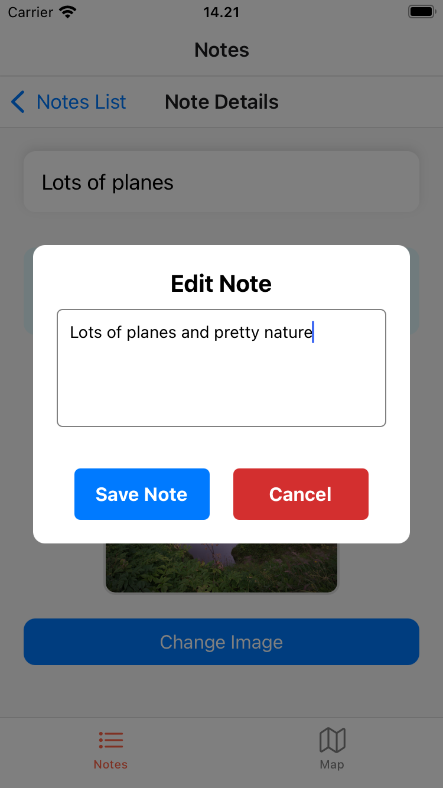
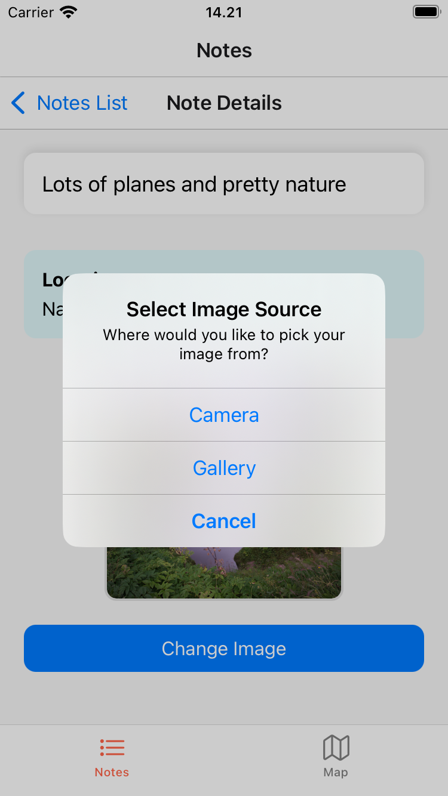
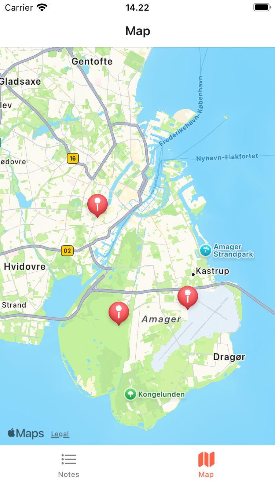
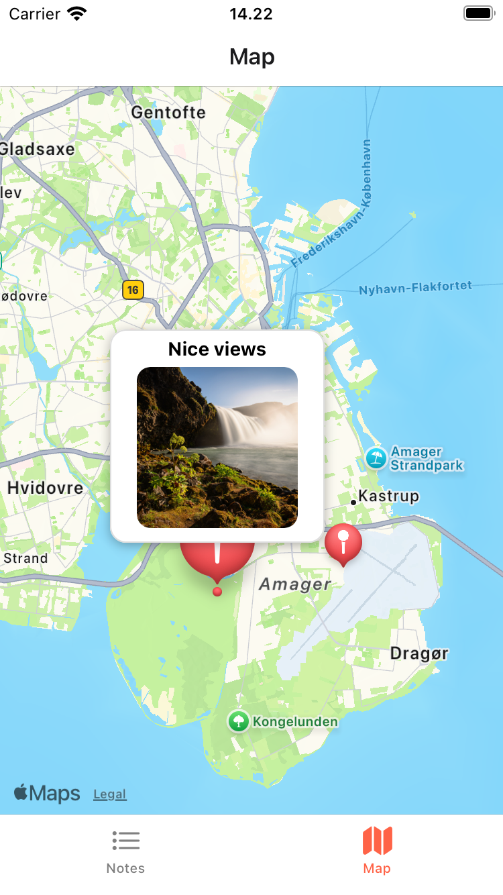
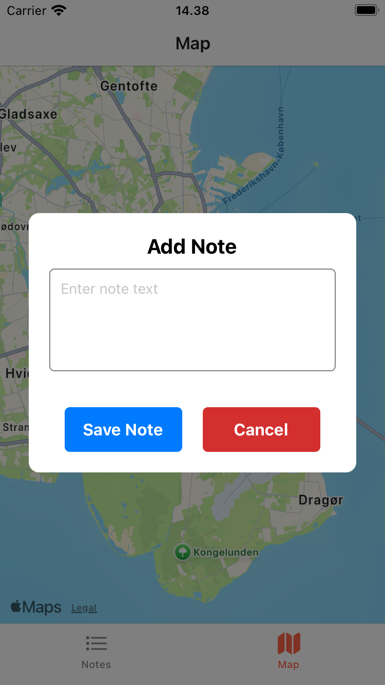

# Note/Map app - React Native

## Overview

This application allows users to take notes with optional location data and images. The app integrates Firebase Firestore/Storage to store notes, including text, location coordinates, and images. The user can view notes on a map and edit them as needed. Additionally, the app supports adding new notes by tapping on the map and saving them with location information.

### You'll have to provide your own firebaseConfig.js

---

### List of notes, along with their location:

---

### Details for a single note which has both image and location:

---

### Editing a notes text:

---

### Prompt for uploading/chaning image for a note:

---

### Map with markers for note locations:

---

### Viewing a note on the map:

---

### Adding a new note on the map by long-pressing:
